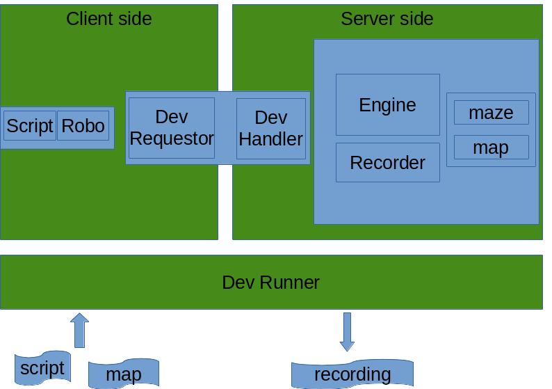

# Robotjes

Robotjes is a simulation environment where Robomind scripts can be executed. The execution of a script 
results in a Recording. A Recording can be played in a browser.

## Roadmap

* Finalize Web Viewer
* start course in IDE (IDLE)
* run labs with rest_server and lower
* [create a pip module](https://packaging.python.org/tutorials/packaging-projects/)

## Developing the Software

The simulation in Robomind Academy has two aspects, the Client side and the Server side. 
The client side consists of a script being execute which triggers calls the Robo (forward, pickup, etc).
The server side contains the simulation of the world where Robo lives. 

In the final setup there will be more distance between client-side and and server-side. During
development they are glued together using RevRunner/DevRequestor/DevHandler.

